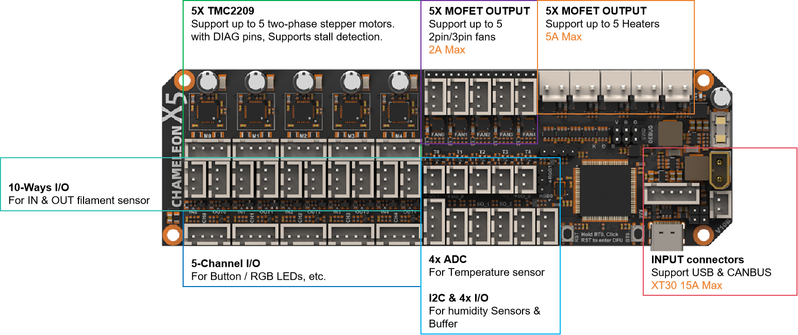

# Introduction

The Chameleon X5 supports CAN bus and USB communication, and is suitable for 5-channel multi-color extrusion and also supports 5-channel heating and drying.

It is based on the STM32F407VET6 microcontroller and TMC2209 stepper motor driver chip, with each channel equipped with the necessary I/O interfaces for filament input/output monitoring and status indication (buttons and LEDs) to ensure stable feeding.

The optional 5-channel heating and drying function includes dedicated interfaces for fan control and heating elements, as well as NTC temperature measurement, and also supports I2C sensors, such as temperature and humidity sensors.

# Features
- Dimensions: 154mm x 48mm
- Based on STM32F407VET6 (168MHz Cortex-M4)
- Supports CANBUS & USB communication
- **Onboard Power Supply:**
  - Input: 24V @ 15A max
  - Onboard DC-DC power supply: 12V @ 3A, 5V @ 3A, 3.3V @ 0.8A
- **5-channel Material Feeding Support:**
  - 5 onboard TMC2209 drivers, supporting 5 stepper motors
  - 10 general-purpose I/O pins for material insertion/extrusion monitoring
  - 5 dual I/O connectors for buttons and LED indicators (with level shifting)
- **5-channel Hot Air Drying Support:**
  - 5x fans, support 2/3 fans, 12V/24V selectable, 2A Max
  - 5x heating interfaces, 5A Max
  - 5x NTC temperature sensor interfaces for temperature detection
  - 1x I2C interface for temperature and humidity sensors
- 4x general-purpose I/O pins, use for external buffers
- 2x Neopixel RGB interfaces for indication or lighting
- Onboard BOOT0 and RST buttons
- Independent input interface board


# FIrmware Guide

### Firmware configuration and compilation

#### Using no bootloader

##### CANBUS communication mode


##### USB communication mode


## Firmware upload

### DFU Mode

firmware flashing can only be performed after entering DFU mode.
How to get in DFU mode:
1. hold BT0 button for 2 seconds
2. Hold RST button for 2 seconds
3. Release the RST button
4. wait 2seconds
5. Release the BT0 button
"lsusb" check if get in DFU mode


### Upload Bootloader

Command：

```shell
cd ~/klipper
make flash FLASH_DEVICE=0483:df11
```

# Attachments
- [Happy-Hare](https://github.com/moggieuk/Happy-Hare/wiki)